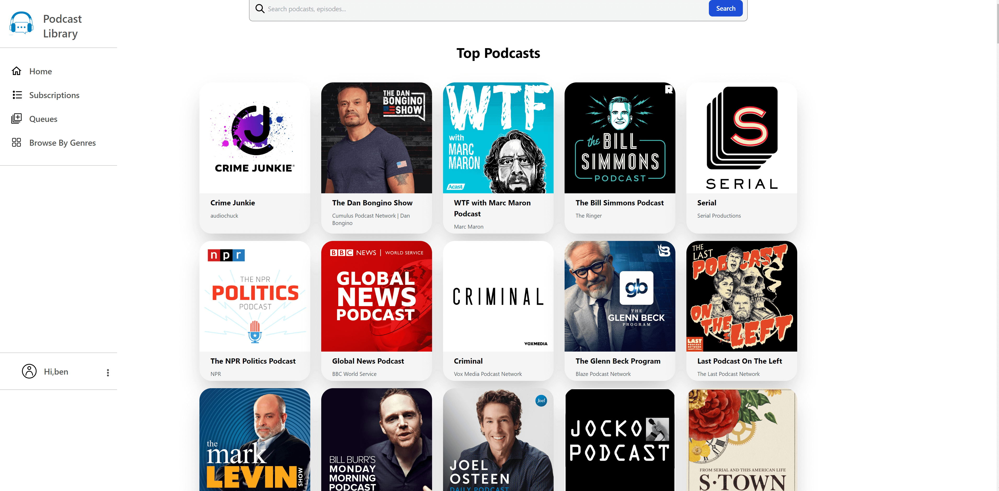
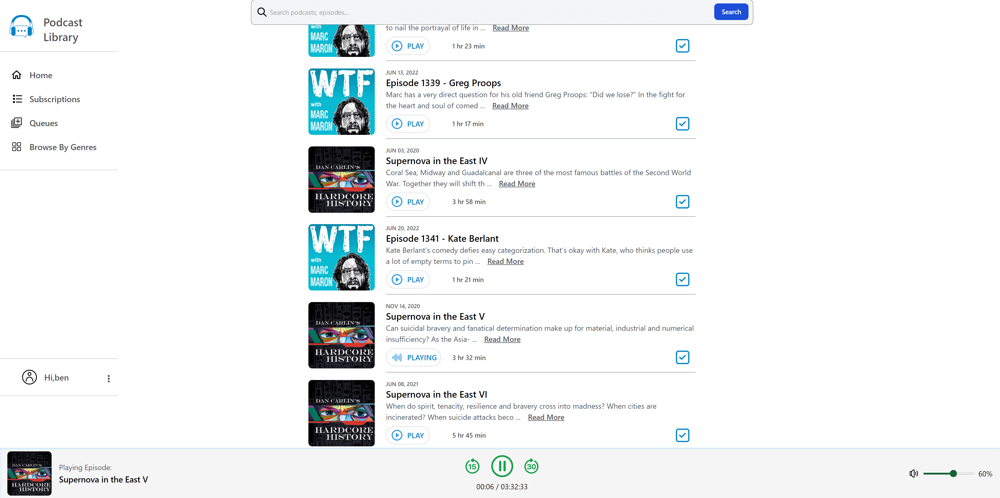

# README

## Introduction

This full-stack project is a podcast library that can help the users to manage and play their podcasts from itunes.
User can use his/her account to browse top podcasts, add podcast subscriptions and creating playlist. He/she can also search podcast/episode on the page and use the built in audio player to listen to the episodes.

**Click here to check the live demo site** ➡️ https://wondrous-mandazi-28ebe8.netlify.app/

## Tech Stack

- Ruby On Rails
- React
- PostgresSQL
- Tailwind

## Dependencies

#### Backend:

- ruby
- rails@6.1.5 or above
- rack-cors
- bcrypt
- puma
- rest-client
- spring
- listen
- bootsnap

#### Frontend:

- react@18.2.0 or above
- react-router-dom
- react-redux@8.0.2 or above
- axios
- tailwindcss
- typescript
- headlessui

## Setups

```
$ git clone git@github.com:BENcao318/podcast-lib.git podcast-lib
$ gem install
$ cd client
$ npm install
```

```
- Start the server:
$ rails server
- Start the client:
$ cd client
$ npm start
- Access the page on localhost:3001
```

## Screenshots

- Home page
  

- Podcast page
  

- Subscription page
  

- Queues page
  

- Playing podcasts
  

- Browsing genres
  

- Searching podcast/episode (NBA)
  .png>)

- Signin page
  
  
- Signup page
  

